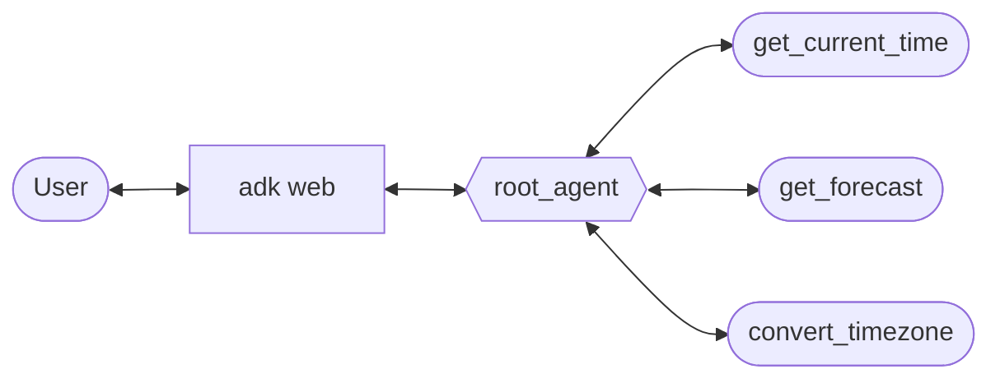
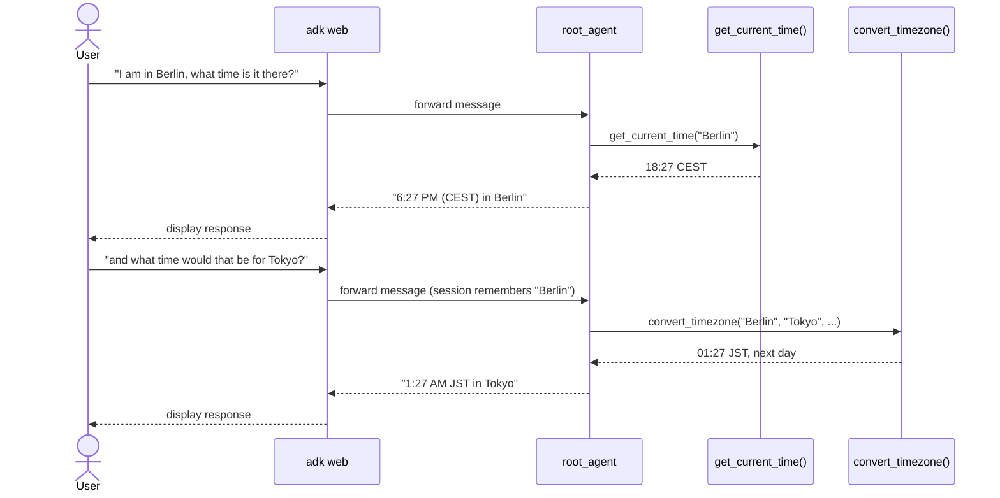
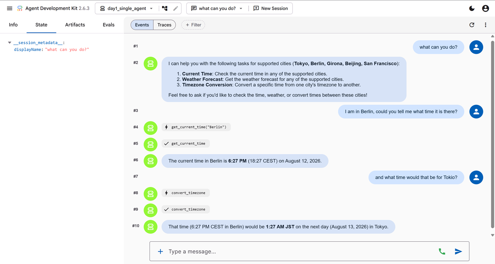

# Day 1 — Single Agent + Tools

**Concept:** `Agent` (aka `LlmAgent`) is ADK's base unit. You give it a model, an
`instruction` (system prompt), and a list of `tools` — plain Python functions the
model can choose to call mid-conversation. That's the whole primitive.

**Do this:**
1. `cp .env.example .env`, paste in a key from https://aistudio.google.com/apikey
2. Fill in the 4 TODOs in `agent.py`
3. Sanity-check structurally (no API call, free), from the repo root: `pytest day1_single_agent`
4. Actually run it: from the repo root, `adk web --port 8000`, pick `day1_single_agent`
   in the UI, ask it "what's the weather in <one of your cities>?"
5. Optional, costs tokens: `pytest -m integration day1_single_agent` runs
   `test_agent.py` — real model calls that assert on which tool got called,
   not on exact wording.

**Stretch goal:** add a third tool, `convert_timezone(city_from: str, city_to: str,
time: str) -> dict`, and update the instruction so the model chains both tools
(get the time in one city, then convert it) without you telling it the exact steps.
That chaining-without-a-script behavior is the thing that's genuinely different
from a fixed pipeline — worth noticing now before Day 2 gives you the fixed-pipeline
version to compare against.

## System diagram

## Chaining tools across a follow-up

The exchange below is what's actually captured live in [`demo.png`](demo.png) — a
real `adk web` session, not a mock. It's the interesting part of Day 1: the model
decides which tool to call, and carries "Berlin" forward into the second question
without being told to.

