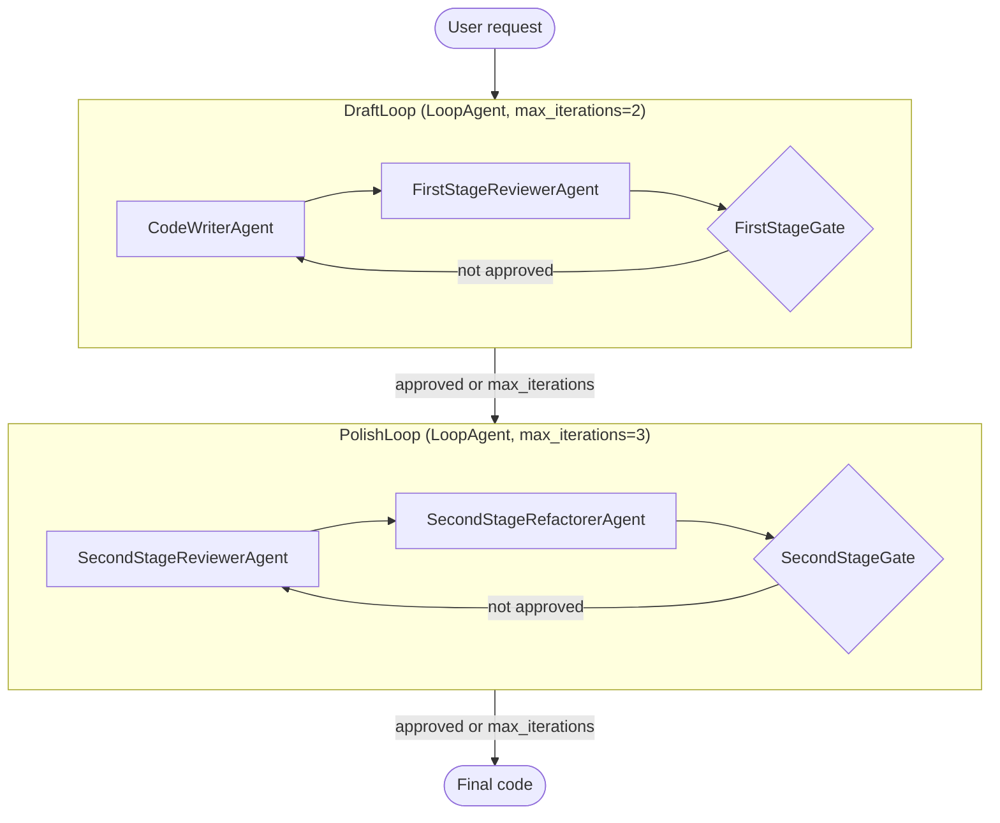

# Day 2 — SequentialAgent (fixed pipeline)

**Concept:** `SequentialAgent` runs a list of sub-agents in a strict, unchanging
order. Data moves between them via `output_key` (where an agent's answer gets
stored) and `{that_key}` template references inside a downstream agent's
`instruction` string. No agent is "deciding" anything about control flow — the
list order is the whole program.

**Do this:**
1. `cp .env.example .env`, add your key
2. Fill in the 3 TODOs in `agent.py`
3. From the repo root: `pytest day2_pipeline` (free structural checks)
4. `adk web --port 8000` from repo root, pick `day2_pipeline`, ask it to
   "write a function that reverses a linked list"
   — watch the trace/state panel in the web UI to see `generated_code` and
   `review_comments` actually populate between stages.
5. Optional, costs tokens: `pytest -m integration day2_pipeline` runs
   `test_agent.py`, which checks the three stages actually ran in order —
   the automated version of step 4's manual trace-panel check.

**Stretch goal**: the question was how you'd restructure this pipeline
if the reviewer should be able to send code back to the writer instead of
always moving forward once. Two phased `LoopAgent` is the answer:

- **DraftLoop** with writer and a first-stage reviewer alternate on the *same*
  `code` state key until the reviewer judges it functionally correct (or
  `max_iterations` is hit as a backstop).
- **PolishLoop** with a second reviewer, with a different prompt (style/
  readability/efficiency), alternates with a refactorer on
  that same `code` key.

Both loops read and write **one shared `code` key** which travels between stages.



Two ways to end a loop early:

1. **A tool the reviewer calls itself**: give it `exit_loop`, a function that
   sets `tool_context.actions.escalate = True`. The LLM decides when to call
   it, based on its own judgment of its own review.
2. **A dedicated checker agent**: a small `BaseAgent`
   that reads the reviewer's comments back out of state, and yields
   `Event(actions=EventActions(escalate=...))` deterministically.

```python
from google.adk.agents import LlmAgent, LoopAgent, SequentialAgent, BaseAgent
from google.adk.agents.invocation_context import InvocationContext
from google.adk.events import Event, EventActions
from typing import AsyncGenerator

MODEL = "gemini-flash-latest"

code_writer_agent = LlmAgent(
    name="CodeWriterAgent",
    model=MODEL,
    instruction="""
    Write Python code that fulfills the requirement below.
    If previous code and review comments are present, revise the previous code to address the comments.

    Requirement:
    {requirement}

    Previous code:
    {code}

    Review comments:
    {first_stage_comments}

    Output only the complete Python code block, enclosed in triple backticks.
    """,
    output_key="code",
)

first_stage_reviewer_agent = LlmAgent(
    name="FirstStageReviewerAgent",
    model=MODEL,
    instruction="""
    Review the code below for correctness and completeness only — does it actually fulfill the requirement.

    Code:
    {code}

    If it fully works, output "No major issues found."
    Otherwise output a concise bulleted list of what's missing or broken.
    """,
    output_key="first_stage_comments",
)

class FirstStageGate(BaseAgent):
    async def _run_async_impl(self, ctx: InvocationContext) -> AsyncGenerator[Event, None]:
        comments = ctx.session.state.get("first_stage_comments", "")
        approved = "no major issues found" in comments.lower()
        yield Event(author=self.name, actions=EventActions(escalate=approved))

draft_loop = LoopAgent(
    name="DraftLoop",
    max_iterations=2,
    sub_agents=[code_writer_agent, first_stage_reviewer_agent, FirstStageGate(name="FirstStageGate")],
)

second_stage_reviewer_agent = LlmAgent(
    name="SecondStageReviewerAgent",
    model=MODEL,
    instruction="""
    Review the code below for style, readability, and efficiency only — assume it already works correctly.

    Code:
    {code}

    If there is nothing worth improving, output "No major issues found."
    Otherwise output a concise bulleted list of suggestions.
    """,
    output_key="second_stage_comments",
)

second_stage_refactorer_agent = LlmAgent(
    name="SecondStageRefactorerAgent",
    model=MODEL,
    instruction="""
    Apply the suggestions below to the code. If there are no suggestions, return the code unchanged.

    Code:
    {code}

    Suggestions:
    {second_stage_comments}

    Output only the final code block.
    """,
    output_key="code",
)

class SecondStageGate(BaseAgent):
    async def _run_async_impl(self, ctx: InvocationContext) -> AsyncGenerator[Event, None]:
        comments = ctx.session.state.get("second_stage_comments", "")
        approved = "no major issues found" in comments.lower()
        yield Event(author=self.name, actions=EventActions(escalate=approved))

polish_loop = LoopAgent(
    name="PolishLoop",
    max_iterations=3,
    sub_agents=[second_stage_reviewer_agent, second_stage_refactorer_agent, SecondStageGate(name="SecondStageGate")],
)

code_pipeline_agent = SequentialAgent(
    name="CodePipelineAgent",
    sub_agents=[draft_loop, polish_loop],
)

root_agent = code_pipeline_agent
```
