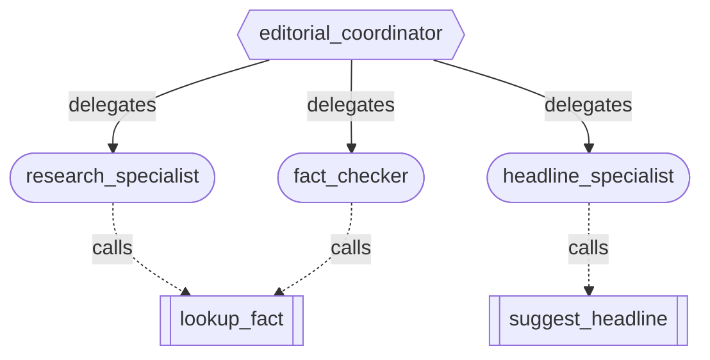
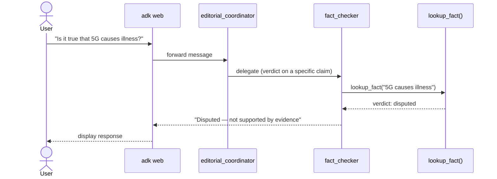

# Day 3 — Dynamic Delegation (`sub_agents`)

**Concept:** give an `Agent` a `sub_agents=[...]` list instead of `tools=[...]`
and it becomes a coordinator: on each turn, the model reads every sub-agent's
`description` plus its own `instruction`, and decides whether to answer directly
or transfer control to a specialist. This is different from `AgentTool` (where
the caller invokes another agent like a function and keeps control) — a
sub-agent transfer is a genuine hand-off.

**Do this:**
1. `cp .env.example .env`, add your key
2. Fill in the 4 TODOs in `agent.py`
3. From the repo root: `pytest day3_delegation` (free structural checks)
4. `adk web --port 8000`, pick `day3_delegation`, and try to break your own
   routing on purpose:
   - "Is it true that 5G causes illness?" → should go to `fact_checker`
   - "Give me background on renewable energy policy" → should go to `research_specialist`
   - "Make this headline punchier: 'Local Council Meets Tuesday'" → should go to `headline_specialist`
   - Then try an ambiguous one on purpose, e.g. "tell me about 5G" — no
     "verify" or "headline" signal. See which specialist it picks and whether
     that matches what you'd want. This is the exercise: watch a real
     misroute happen because of a description you wrote.
   - Optional, costs tokens: `pytest -m integration day3_delegation` runs
     the first three scenarios above as automated, parametrized checks.

**Stretch goal:** add a fourth specialist whose description *deliberately*
overlaps heavily with an existing one, and watch routing get flaky between the
two. Then fix it by tightening both descriptions. This is the actual skill —
not writing the Python, but writing descriptions precise enough to route
reliably, since that's the entire interface the framework gives you for control
over multi-agent behavior.

## Diagrams

Intended flow, not yet captured live (real run hit a 503 mid-request):

