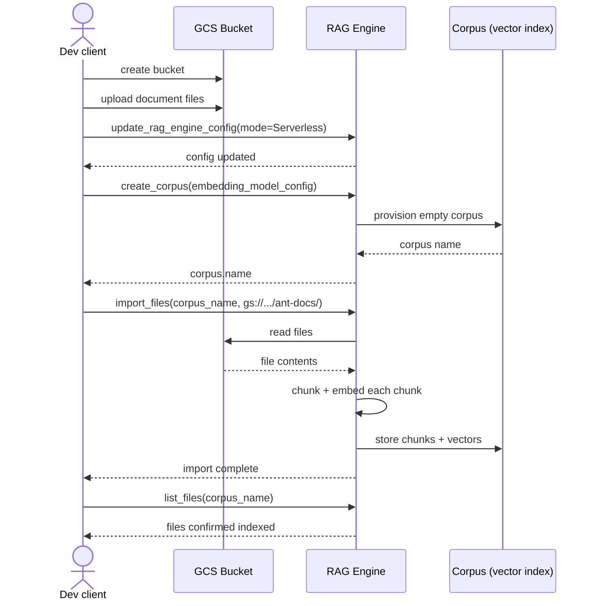
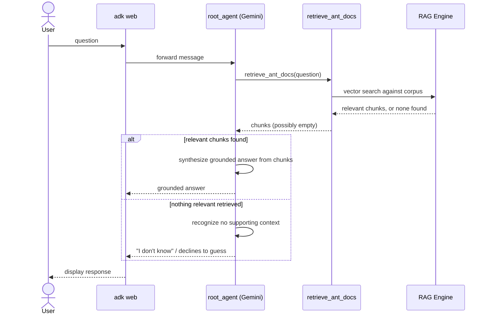

# Day 4 — Grounding with RAG Engine

**Why this is a brief, not pre-written code:** RAG Engine is a hosted service
under Google's Gemini Enterprise Agent Platform (formerly Vertex AI) — it needs
a real GCP project, billing enabled, and a corpus of documents uploaded to it.
The exact SDK calls (corpus creation, import, retrieval tool wiring) are the
kind of detail that drifts between ADK releases, so getting them from a
grounded doc lookup right when you need them beats a snapshot I write now that
might be stale by the time you run it.

**Concept to walk in with:** so far every agent has answered from the model's own
training + whatever's in the conversation. RAG Engine gives an agent a retrieval
tool over *your* documents — it searches a vector index and hands the model back
relevant chunks before it answers. This is the same idea as any RAG system
you've used before; the news is Google's managed version of the vector-store +
retrieval-tool plumbing specifically.

**Build task:**
1. Pick a small doc set you actually care about — even 3-5 markdown files from
   one of your real projects works. Don't use throwaway content; a real corpus
   makes bad retrieval obvious in a way fake content doesn't.
2. Look up the current Python snippet for creating a corpus, importing your
   documents, and attaching retrieval as a tool on an `Agent` from official
   docs — don't guess at the syntax.
3. Build `day4_grounding/agent.py` following that pattern — same shape as Days
   1-3 (root_agent, tools list), just with a retrieval tool instead of a mock one.
4. Ask it something your docs actually answer, and something they don't. Confirm
   it says "I don't know" (or similar) on the second one rather than making
   something up — that's the actual test of whether grounding is working, not
   whether the first question worked.

## Diagrams

Setup, bucket, corpus, import:

Runtime, grounded vs. ungrounded question:

