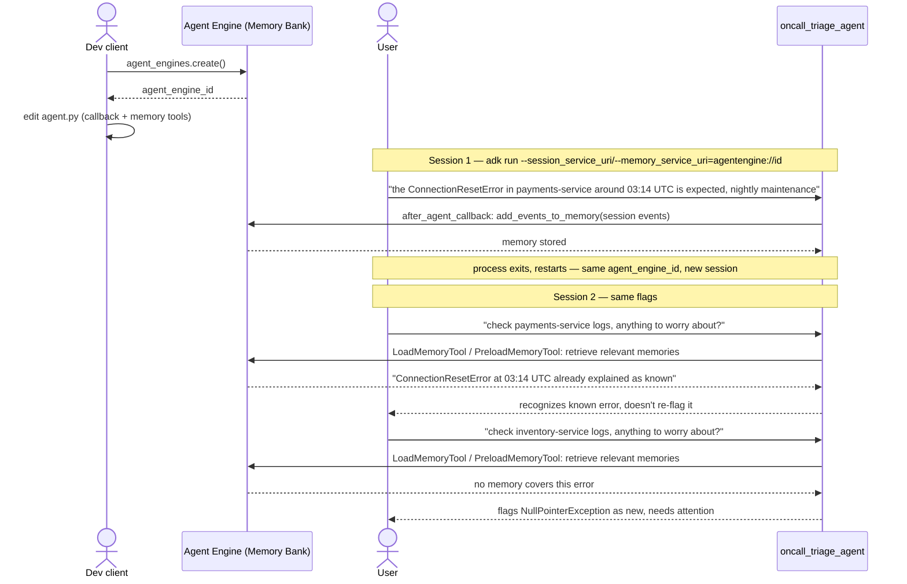

# Day 5 — Memory Bank

**Why this is a brief:** Memory Bank is a hosted Gemini Enterprise Agent Platform
service (session storage + cross-session memory retrieval). Look up the exact
wiring from current official docs. Don't guess at the syntax.

**Concept:**
- Everything through Day 3 forgets everything when the process restarts.
  Session state (`output_key` values) lives only within one run.
- Memory Bank persists facts across separate sessions with the same user or
  agent, for example "this user prefers concise answers."

**Build task:**
1. Extend `day3_delegation` (or a fresh small agent) so it remembers one fact
   about you across two separate `adk run` invocations. Tell it your preferred
   headline style in session 1, restart, then in session 2 ask it to write a
   headline without repeating the preference. Confirm it uses the remembered
   fact unprompted.
2. Note what Memory Bank stored automatically versus what needed explicit
   instruction to store. That boundary is usually the interesting part of any
   memory system.
3. Decide whether this workflow actually needs cross-session memory. Cold-start
   every session is fine for plenty of use cases. Cross-session memory has a
   real cost.

