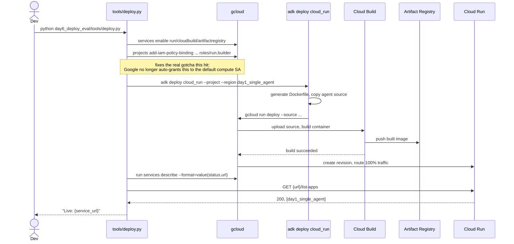
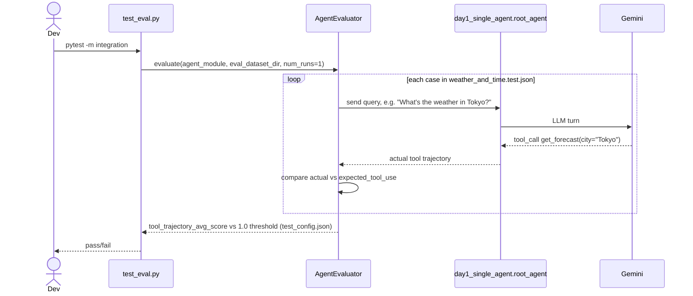

# Day 6 — Deploy + Evaluation

**Why this is a brief:** deployment (Agent Runtime, Cloud Run, GKE) and the
eval framework both need a real GCP project and exact current commands. Look
them up from official docs. Don't guess at the syntax.

**Concept:**

- Two separate concerns: does the agent run somewhere other than your machine
  (deploy), and does it still work correctly after a change (eval).
- ADK's eval framework exists because "still works" is fuzzier to check for an
  LLM agent than for normal code. The same input can validly produce
  different, still-correct outputs.

**Build task:**

1. Deploy the smallest agent (`day1_single_agent`) to Cloud Run. Get a real
   URL you can hit.
2. Write 3-5 eval cases for `day1_single_agent` using ADK's eval framework, for
   example, "asks about Tokyo weather → should call get_forecast with
   city='Tokyo'." Run them.
3. Break something on purpose, for example, rename a tool without updating the
   instruction, and confirm the eval cases catch it. An eval suite that
   doesn't fail when you break what it's testing isn't testing anything. This
   step is the actual point of the exercise.

## Deploy sequence (`tools/deploy.py`)

## Eval framework (mechanics, independent of whether the run finished)

